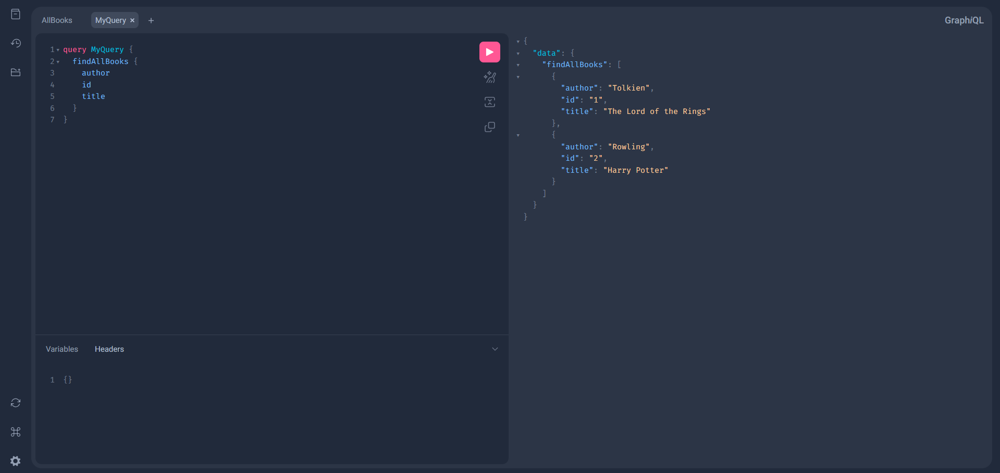
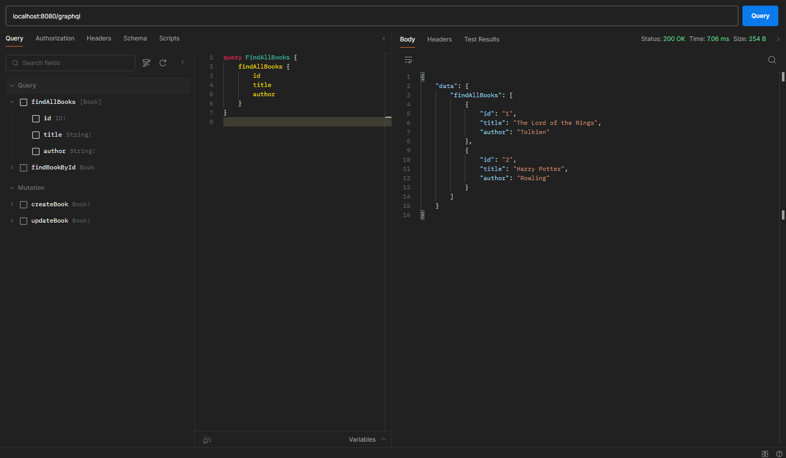

# GraphQL + Spring Boot Example
Start this example as a normal **Spring Boot Application**.

## H2
**H2** is the embedded database and its console is accessible, while the app is running, at the following endpoint: **localhost:8080/h2-console**

### Parameters
**JDBC URL**: jdbc:h2:mem:test \
**User name**: sa \
**Password**: empty

## GraphQL
There are two ways to call the **GraphQL APIs**:
1. Using the **GraphiQL** tool at the following endpoint: **localhost:8080/graphiql**



2. Calling the endpoint `/graphql (POST)` using clients like Postman with the query as the body
   

## Query example
Queries are used to **get** data.

### Single Query
```graphql
query MyQuery {
    findBookById(id: 1) {
        id
        title
        author
    }
}
```
Response:
```json
{
    "data": {
        "findBookById": {
            "id": "1",
            "title": "The Lord of the Rings",
            "author": "Tolkien"
        }
    }
}
```

### Multiple Query
You can exclude properties you don't want, like the ID in this case, to receive a lighter response.

```graphql
query MyQuery {
    findBookById(id: 1) {
        title
        author
    }
    findAllBooks {
        id
        title
        author
    }
}

```
Response:
```json
{
    "data": {
        "findBookById": {
            "title": "The Lord of the Rings",
            "author": "Tolkien"
        },
        "findAllBooks": [
            {
                "id": "1",
                "title": "The Lord of the Rings",
                "author": "Tolkien"
            },
            {
                "id": "2",
                "title": "Harry Potter",
                "author": "Rowling"
            }
        ]
    }
}
```

## Mutation example
Mutations are used to **create or modify** data.

### Create
```graphql
mutation MyMutation {
  createBook(book: {title: "Test", author: "author"}) {
    id
    title
    author
  }
}
```
Response:
```json
{
    "data": {
        "createBook": {
            "id": "3",
            "title": "Test",
            "author": "author"
        }
    }
}
```

### Update
```graphql
mutation MyMutation {
  updateBook(id: 2, title: "Harry Potter 2") {
    id
    title
    author
  }
}
```
Response:
```json
{
    "data": {
        "updateBook": {
            "id": "2",
            "title": "Harry Potter 2",
            "author": "Rowling"
        }
    }
}
```